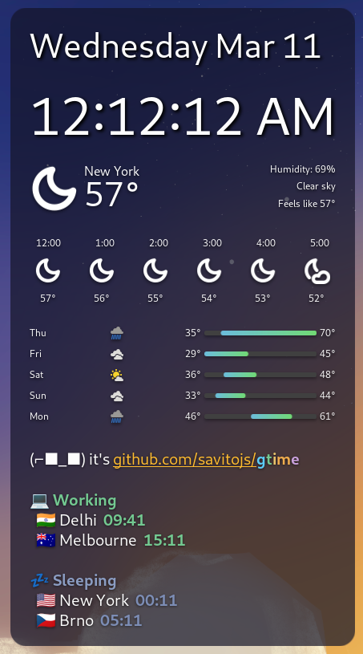

# Global Time Utility (gtime)

[](https://badge.fury.io/py/gtime)
[](https://pypi.org/project/gtime/)
[](https://opensource.org/licenses/MIT)
[](https://scorecard.dev/viewer/?uri=github.com/savitojs/gtime)

**Stop Googling time zones.**


*Recorded in [Ghostty](https://ghostty.org/). Some output may look off in the GIF but works perfectly in a real terminal. Best with Ghostty or [Kitty](https://sw.kovidgoyal.net/kitty/).*

> If this saves you from one more "what time is it in Tokyo?" search, [give it a star](https://github.com/savitojs/gtime).

A modern, colorful Python CLI for global time zone lookup, comparison, and management. Fuzzy search, favorites, live updates, meeting time conversion, and beautiful terminal output.

## Installation

```bash
# With uv (recommended)
uv tool install gtime

# Or with pip
pip install gtime

# From source
git clone https://github.com/savitojs/gtime.git
cd gtime && uv sync
uv run gtime --help
```

## Quick Start

```bash
gtime London                              # Look up any city (fuzzy search)
gtime add Tokyo Singapore "New York"      # Add favorites
gtime                                     # Show all favorites
gtime compare London Tokyo Sydney         # Compare times side by side
gtime meeting at "2:00 PM"                # Convert across favorites
gtime meeting at "3 PM UTC"               # With timezone support
gtime watch                               # Live monitoring (refreshes every 60s)
```

## Features

**Smart search** - Fuzzy matching, case-insensitive, works with typos (`gtime toky` finds Tokyo), and country names (`gtime india` finds Delhi).

**Favorites** - Save your most-used cities. Sorted by UTC offset for a natural reading order.

```bash
gtime add London Tokyo Mumbai Berlin      # Add multiple cities
gtime remove Berlin                       # Remove a city
gtime                                     # View all favorites
```

**Meeting planner** - Convert a meeting time across all your favorite cities. Supports 12/24-hour format and timezone abbreviations.

```bash
gtime meeting at "10:00 AM"               # Your local time across favorites
gtime meeting at "15:30"                   # 24-hour format
gtime meeting at "9:00 AM EST"            # Eastern Standard Time
gtime meeting at "3 PM UTC"               # Coordinated Universal Time
```

**Live watch mode** - Real-time updates for favorites or specific cities.

```bash
gtime watch                               # Monitor all favorites
gtime compare London Tokyo --watch        # Watch specific cities
```

## GNOME Desktop Widget

Display your favorite cities on your GNOME desktop using the [Desktop Widgets (azclock)](https://extensions.gnome.org/extension/5156/desktop-clock/) extension.



Three styles available:

```bash
gtime widget        # Style A (default) - flags, color-coded time, status
gtime widget b      # Grouped by status (Working, Sleeping, etc.)
gtime widget c      # Compact cards with hour diff from local
```

**Style A** - Flags + color-coded time + status:
```
🇺🇸 New York   23:05       ● Sleeping  UTC-4
🇨🇿 Brno       04:05  +1d  ● Sleeping  UTC+1
🇮🇳 Delhi      09:35  +1d  ● Working   UTC+5:30
🇦🇺 Melbourne  14:05  +1d  ● Working   UTC+11
```

**Style B** - Grouped by status:
```
💻 Working
  🇮🇳 Delhi      09:35  +1d
  🇦🇺 Melbourne  14:05  +1d
💤 Sleeping
  🇺🇸 New York   23:05
  🇨🇿 Brno       04:05  +1d
```

**Style C** - Compact cards:
```
🇺🇸 New York  🌙
   23:05  ● Sleeping  local
🇮🇳 Delhi  🌅
   09:35  +1d  ● Working  +9.5h
```

### Setup

1. Install the [Desktop Widgets](https://extensions.gnome.org/extension/5156/desktop-clock/) GNOME extension
2. Add a widget with a **Command Label** element
3. Set the command to `gtime widget a` (or `b` / `c`)
4. Enable **Polling** with interval `60000` (1 minute)

A reference dconf config is included at `gtime/widget-azclock-sidebar.dconf`:

```bash
# Back up first
dconf dump /org/gnome/shell/extensions/azclock/ > backup.dconf

# Import the sidebar layout
dconf load /org/gnome/shell/extensions/azclock/ < gtime/widget-azclock-sidebar.dconf
```

## Development

```bash
uv venv .venv && source .venv/bin/activate
uv sync
pytest tests/
```

Contributions welcome! Fork, branch, make changes, add tests, and open a PR.

## License

MIT - see [LICENSE](LICENSE).

---

[Report bugs](https://github.com/savitojs/gtime/issues) or [request features](https://github.com/savitojs/gtime/issues).

**Made with ❤️ for developers working across time zones**
